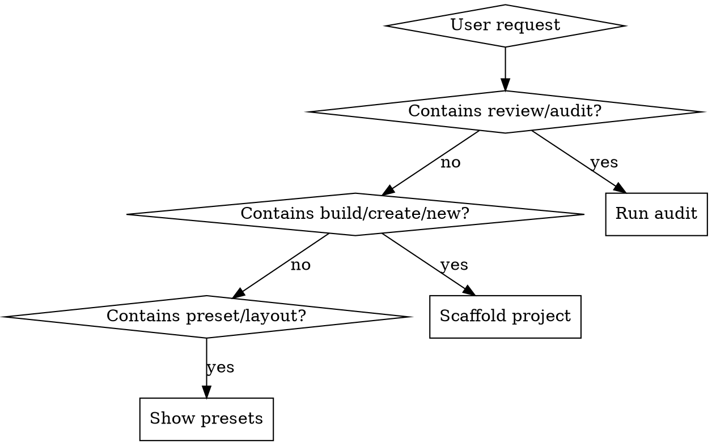

# IBM Design Language Portfolio

Build and audit portfolio project pages (landing pages + Reveal.js slides) for IBM Design Language compliance.

## Intent Routing

### Review Mode (`/ibm-portfolio review [path]`)
Scan a page for compliance across 8 categories. Output structured report with PASS/WARN/FAIL per rule, line numbers, and fix suggestions. Read `references/audit-checklist.md` for the full rule set.

### Build Mode (`/ibm-portfolio build <name>`)
1. Present preset selection (read `references/presets.md`)
2. Collect project info via AskUserQuestion (name, tagline, description, tags)
3. Create `<name>/` folder with `index.html` and `css/style.css`
4. Generate HTML following the selected preset's section sequence
5. Update root `index.html` (TOC entry, project card, quick links)
6. Auto-run audit on the new page

### Preset Mode (`/ibm-portfolio preset`)
Display the 4 approved layout presets from `references/presets.md`.

## Quick Token Reference

### Colors (use ONLY `var(--ibm-*)` — never raw hex outside `:root`)
| Token | Hex | Use |
|-------|-----|-----|
| `--ibm-blue-60` | `#0f62fe` | Primary actions, links, accents |
| `--ibm-blue-70` | `#0043ce` | Hover state for blue-60 |
| `--ibm-gray-100` | `#161616` | Dark backgrounds, body text |
| `--ibm-gray-90` | `#262626` | Terminal bar, code blocks |
| `--ibm-gray-80` | `#393939` | Inline code on dark bg |
| `--ibm-gray-70` | `#525252` | Muted text, icons |
| `--ibm-gray-30` | `#c6c6c6` | Body text on dark bg |
| `--ibm-gray-20` | `#e0e0e0` | Borders |
| `--ibm-gray-10` | `#f4f4f4` | Light section bg, inline code bg |
| `--ibm-red-60` | `#da1e28` | Danger, warnings, callout borders |
| `--ibm-yellow-30` | `#f1c21b` | Caution icons |
| `--ibm-green-50` | `#24a148` | Success, positive indicators |
| `--ibm-white` | `#ffffff` | Page bg, text on dark bg |

### Spacing (use ONLY `var(--space-*)` — never raw rem/px for padding/margin/gap)
| Token | Value | Common Use |
|-------|-------|------------|
| `--space-1` | 0.25rem (4px) | Tight inner padding |
| `--space-2` | 0.5rem (8px) | Tag gaps, small margins |
| `--space-3` | 0.75rem (12px) | Label bottom margin, card inner |
| `--space-4` | 1rem (16px) | Standard gap, paragraph spacing |
| `--space-5` | 1.5rem (24px) | Section title margin, card padding |
| `--space-6` | 2rem (32px) | Grid gap, group spacing |
| `--space-7` | 2.5rem (40px) | Large element spacing |
| `--space-8` | 3rem (48px) | Section padding small |
| `--space-9` | 4rem (64px) | Section padding standard |
| `--space-10` | 5rem (80px) | Section padding large |

### Typography
- **Fonts:** IBM Plex Sans (300/400/600), IBM Plex Mono (400)
- **h1:** 2.625rem, weight 300, line-height 1.2
- **h2:** 2rem, weight 300, line-height 1.25
- **h3:** 1.25rem, weight 600, line-height 1.4
- **h4:** 0.875rem, weight 600, uppercase, letter-spacing 0.16px
- **body:** 1rem, weight 400, line-height 1.5
- **label:** 0.75rem, weight 400, uppercase, letter-spacing 0.32px
- **code:** 0.875em, IBM Plex Mono

## Critical Rules

1. **Never use raw hex values** outside `:root` — always `var(--ibm-*)` tokens
2. **Never use raw spacing values** for padding/margin/gap — always `var(--space-*)`
3. **Every section** must use the `section-label` + `section-title` pattern
4. **Every page** must include Google Fonts link for IBM Plex Sans (300/400/600) + Plex Mono (400)
5. **Every page** must include OG meta tags (og:title, og:description, og:type)
6. **All transitions** use `0.15s ease` (IBM standard productive motion)
7. **Grid layout** uses `.container` wrapper (max-width 82rem) with `.grid-2`/`.grid-3`
8. **Breakpoints:** 42rem (tablet) and 66rem (desktop) — no other breakpoints
9. **Font families** must use `var(--font-body)` and `var(--font-mono)` — never raw font names in HTML
10. **Inline `style=""` attributes** should be minimized — use CSS classes instead

## Reference Files

- `references/design-tokens.md` — Complete token spec (colors, spacing, type, grid, motion)
- `references/component-catalog.md` — All components with HTML/CSS patterns
- `references/audit-checklist.md` — Structured compliance rules for pages + slides
- `references/presets.md` — 4 approved page layout presets
- `references/slides-guide.md` — Reveal.js slide conventions and IBM theme rules

## Templates

- `templates/project-landing.html` — Annotated Preset A starter template
- `templates/slides-boilerplate.html` — Reveal.js slide deck starter with IBM theme
