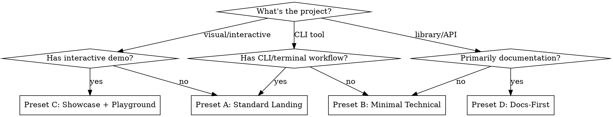

# Design Presets

Four approved page layout presets for portfolio project landing pages. Each preset defines a section sequence, section variants, and component types.

## Preset A: Standard Landing

**Best for:** CLI tools, developer tools (like `ev`)

| # | Section | Variant | Components | Purpose |
|---|---------|---------|------------|---------|
| 1 | Hero | dark | h1, subtitle, terminal block, CTA buttons | First impression + demo |
| 2 | Problem | light | section-label/title, 3-column card grid with icons | Why this exists |
| 3 | How It Works | white | section-label/title, flow steps (4 steps with arrows) | Core workflow |
| 4 | Features | light | section-label/title, 3-column card grid (6 cards) | Capabilities |
| 5 | Callout | dark | callout box with comparison (before/after lists) | Key differentiator |
| 6 | Quick Start | white | section-label/title, terminal block, install note | Get started fast |
| 7 | Reference | light | section-label/title, command reference table | Complete API |
| 8 | Footer | dark (footer) | Name, links, license | Standard footer |

**Section pattern:** dark → light → white → light → dark → white → light → dark

---

## Preset B: Minimal Technical

**Best for:** Libraries, APIs, SDKs

| # | Section | Variant | Components | Purpose |
|---|---------|---------|------------|---------|
| 1 | Hero | dark | h1, subtitle (text only, no terminal), CTA buttons | Clean introduction |
| 2 | Overview | white | section-label/title, 2-column grid (text + code block) | What it does |
| 3 | Features | light | section-label/title, 3-column card grid (6 cards) | Key capabilities |
| 4 | API Reference | white | section-label/title, reference table with code examples | Technical details |
| 5 | Quick Start | light | section-label/title, terminal block | Getting started |
| 6 | Footer | dark (footer) | Name, links, license | Standard footer |

**Section pattern:** dark → white → light → white → light → dark

---

## Preset C: Showcase + Playground

**Best for:** Interactive projects, visual tools, demos

| # | Section | Variant | Components | Purpose |
|---|---------|---------|------------|---------|
| 1 | Hero | dark | h1, subtitle, screenshot/demo placeholder, CTA buttons | Visual first impression |
| 2 | Before/After | light | section-label/title, 2-column comparison (code/terminal blocks) | Show the transformation |
| 3 | Features | white | section-label/title, 3-column card grid (6 cards) | Capabilities |
| 4 | Playground | light | section-label/title, embedded iframe or interactive area | Try it now |
| 5 | How It Works | white | section-label/title, flow steps | Under the hood |
| 6 | Quick Start | light | section-label/title, terminal block, install note | Get started |
| 7 | Footer | dark (footer) | Name, links, license | Standard footer |

**Section pattern:** dark → light → white → light → white → light → dark

---

## Preset D: Docs-First

**Best for:** Mature projects with comprehensive documentation

| # | Section | Variant | Components | Purpose |
|---|---------|---------|------------|---------|
| 1 | Hero | dark | h1, subtitle, install command (single terminal line), CTA buttons | Quick install |
| 2 | Quick Start | white | section-label/title, prominent terminal block with full setup flow | Get running fast |
| 3 | Features | light | section-label/title, 2-column card grid (4 compact cards) | Compact overview |
| 4 | Configuration | white | section-label/title, code block + reference table | Config reference |
| 5 | API / Commands | light | section-label/title, detailed reference table | Complete reference |
| 6 | FAQ / Troubleshooting | white | section-label/title, callout boxes or card list | Common issues |
| 7 | Footer | dark (footer) | Name, links, license | Standard footer |

**Section pattern:** dark → white → light → white → light → white → dark

---

## Preset Selection Guide

## Common Rules for All Presets

1. **First section is always dark** (hero)
2. **Last section is always dark** (footer)
3. **Adjacent sections never share the same variant** (alternate dark/light/white)
4. **Every section has `section-label` + `section-title`** (except hero h1 and footer)
5. **Hero always has CTA buttons** (at least one primary + one ghost)
6. **Root `index.html` must be updated** (TOC, project card, quick links)
